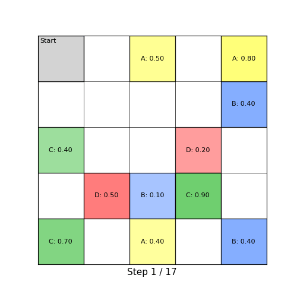

# Motion Planning Under Temporal Logic Specifications In Semantically Unknown Environments

Code for the paper **[Motion Planning Under Temporal Logic Specifications In Semantically Unknown Environments](https://arxiv.org/abs/2511.03652)** (Azizollah Taheri & Derya Aksaray, arXiv:2511.03652).

---

<p align="center">
  
</p>

---

## Overview

Temporal logic planning when the semantic labels are uncertain. The environment is modeled as a **PL-DMDP** with a probabilistic belief over labels, combined with the task DFA into a **product automaton** $\mathcal{P} = \mathcal{M} \times \mathcal{A}$. Edges of $\mathcal{P}$ carry label probabilities. The expected return under a policy $\pi_p$ is

$$
U^{\pi_p}(s_p) = \mathbb{E}^{\pi_p}\left[\sum_{i=0}^{\infty} \gamma^i \, r\left(s_p(i),\, \pi_p(s_p(i)),\, s_p(i+1)\right) \,\bigg|\, s_p(0) = s_p \right]
$$

with the reward

$$
r(s_p, \sigma, s'_p) =
\begin{cases}
-\dfrac{\beta}{1-\gamma} & \text{if } s_p \notin \mathcal{F}_t,\ s'_p \in \mathcal{F}_t \\
0 & \text{if } s_p \in \mathcal{F}_a \cup \mathcal{F}_t \\
-\beta & \text{otherwise}
\end{cases}
$$

and the optimal policy

$$
\pi_p^* = \arg\max_{\pi_p \in \Pi_p} U^{\pi_p}(s_p)
$$

is computed by value iteration. Any optimal policy has at least one trajectory reaching an accepting state without going through a trash state. As the robot senses, the belief is corrected and replanning is triggered when the prior disagrees with the truth.

---

## Repository structure

```
.
├── config.py             # Grid, formula, true label map, prior belief
├── main.py               # Entry point
├── dfa.py                # scLTL -> total DFA via Spot
├── product_automaton.py  # M x A construction
├── planning.py           # Value iteration, reward, update-trigger
├── labeling.py           # Belief grid, sensing, updates
├── grid.py               # Grid graph
└── visualization.py      # Step-by-step animation
```

---

## Prerequisites

```bash
conda install -c conda-forge spot
pip install numpy networkx matplotlib pillow
```

---

## Quick start

```bash
python main.py
```

Saves the run to `trajectory.gif`.

---

## Configuration (`config.py`)

| Parameter | Default | Description |
|-----------|---------|-------------|
| `n`, `m` | `5`, `5` | Grid dimensions (state = `row * n + col`) |
| `formula` | $\varphi_1$ | Temporal logic formula in Spot syntax |
| `regions` | `['a','b','c','d']` | Atomic propositions |
| `true_locations` | dict | Cell → list of true atoms |
| `initial_belief` | dict / `None` | Prior belief per cell |

Default task ($\varphi_1$ from the paper): visit A, B, C while avoiding D, with B before C, and D forbidden before A or C.

$$
\varphi_1 = (\neg c \, U \, b) \wedge (\Diamond c) \wedge (\Diamond a) \wedge (\neg d \, U \, a) \wedge (\neg d \, U \, c)
$$

---

## Dependencies

| Library | Purpose |
|---------|---------|
| [Spot](https://spot.lre.epita.fr/) + BuDDy | scLTL → DFA, BDD ops |
| NumPy, NetworkX | Belief grid, product automaton |
| Matplotlib + Pillow | GIF animation |
